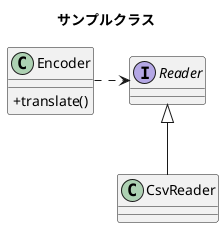

#　開発資料

## 機能概要

- 機能１
- 機能２

##　クラス図
```python
a = datetime.datetime.now()
for l in my_list:
    print(l)


```



- DB
- -create_tables
  - update_weather_date(index_nbr,date)
  - get_whether_date(index_nbr.from,to)
  - get_index_nbr
  - exec
  - 
  
- amedasapi
 -fetch_whether_date(index_nbr,from,to) 

- amedas
 - get_whether_date(index_nbr,from,to) 